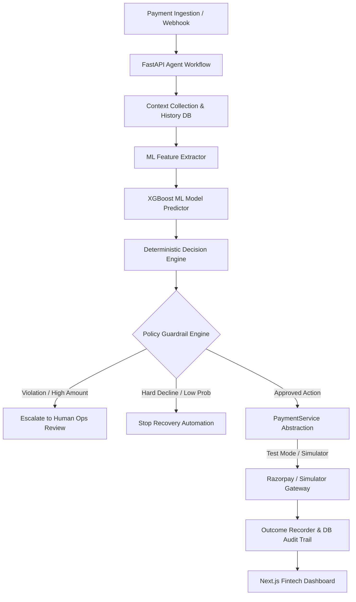
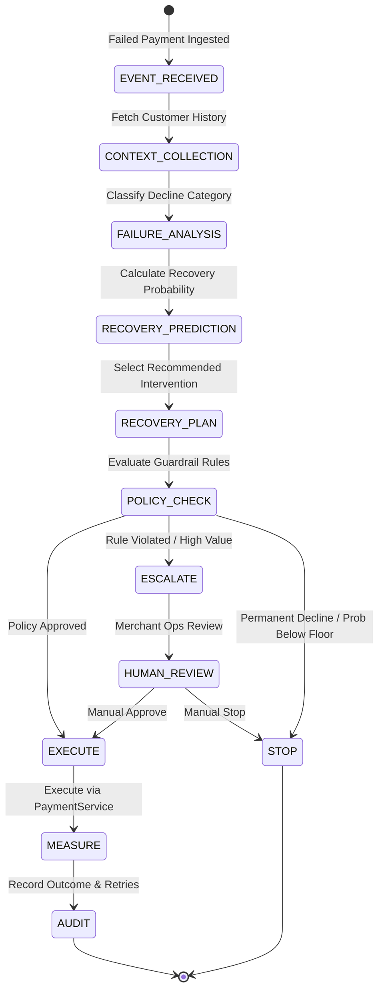
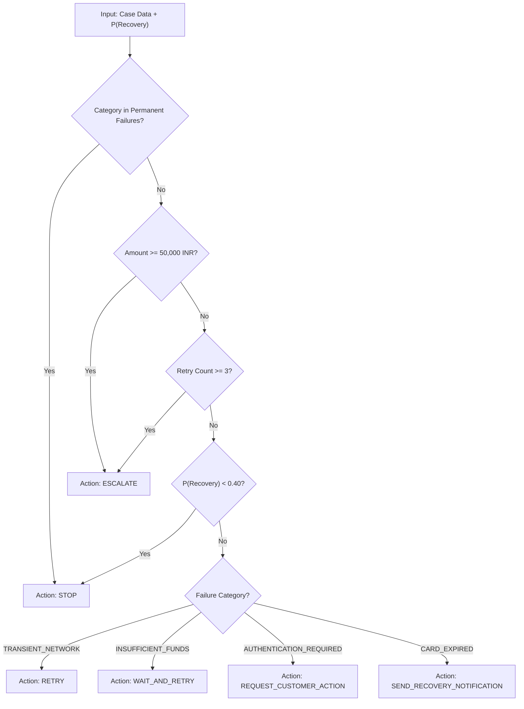
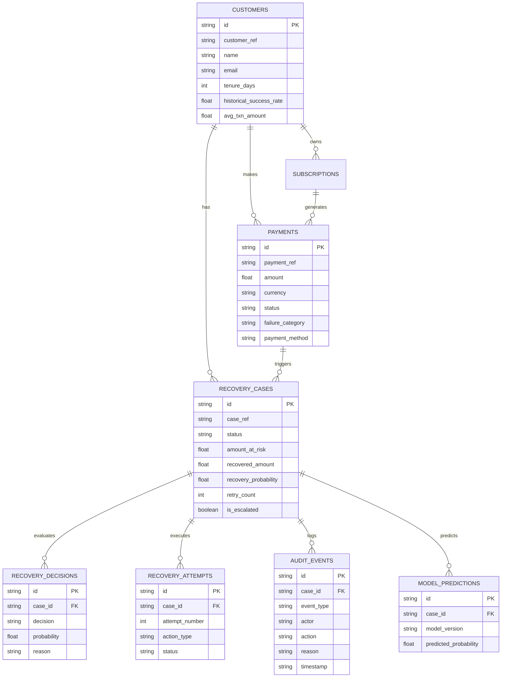

# RevivePay — Autonomous AI Revenue Recovery Platform

[](https://fastapi.tiangolo.com)
[](https://nextjs.org)
[](https://scikit-learn.org)
[](https://xgboost.readthedocs.io)
[](https://www.sqlalchemy.org)
[](https://razorpay.com)

**RevivePay** is an autonomous revenue recovery platform engineered for high-volume merchant operations. It detects payment failures, predicts recovery probability using machine learning, executes deterministic interventions guarded by policy rules, interacts with payment gateways via a unified `PaymentService` abstraction, and maintains an append-only audit trail.

> **Zero LLM in Financial Decision Path**: All financial decision making, ML probability inference, policy enforcement, and payment execution operate 100% deterministically without relying on LLMs.
> **Environment Label**: Operating in **SIMULATION** / **RAZORPAY TEST MODE**. All monetary figures are generated dynamically from database records.

---

## Key Features

1. **Autonomous Core Loop**: **Detect → Diagnose → Predict → Decide → Guard → Act → Measure → Audit**
2. **Machine Learning Model Engine**:
   - Feature extraction across customer tenure, payment history, failure categories, and prior recovery attempts.
   - Evaluates Logistic Regression, Random Forest, and XGBoost models.
   - Validated metrics report: Precision, Recall, F1 Score, ROC-AUC, Confusion Matrix, and Calibration Curve.
3. **Deterministic Decision Engine**:
   - Maps probability score, failure category, customer history, and retry counts to explicit actions: `RETRY`, `WAIT_AND_RETRY`, `SEND_RECOVERY_NOTIFICATION`, `REQUEST_CUSTOMER_ACTION`, `ESCALATE`, `STOP`.
4. **Policy Guardrail Engine**:
   - Mandatory safety check enforcing max automated retry limits (default 3), probability floors (e.g. <0.40 -> STOP), high-value amount thresholds (e.g. >= ₹50,000 -> ESCALATE), permanent failure hard stops, and cooldown periods.
5. **Unified PaymentService Abstraction**:
   - Single interface wrapping both live Razorpay Test Mode API and a deterministic scenario simulator.
6. **Append-Only Audit Trail**:
   - Records every event with actor context (`SYSTEM`, `ML_MODEL`, `DECISION_ENGINE`, `POLICY_ENGINE`, `PAYMENT_SERVICE`, `HUMAN_OPERATOR`), action, reasoning, and metadata.
7. **Batch Evaluation Engine**:
   - Executes 500-event demo batches. All KPIs (revenue-at-risk, recovered revenue, recovery rate, attempts, guardrail interventions) are computed exclusively from the current batch's cases — never mixed with prior batches or seeded data.

---

## System Architecture



---

## Agent Workflow State Machine



---

## Decision Flow Chart



---

## Database ER Diagram



---

## Demo Scenario Verification Matrix

When running the **Run Demo Batch (500 Events)** action from the UI, the following deterministic scenarios are exercised:

| Scenario | Condition / Inputs | Agent State Transition | Final Status |
| :--- | :--- | :--- | :--- |
| **Scenario A** | Strong history + Transient network failure | `PREDICT` → `DECIDE(RETRY)` → `POLICY_PASS` → `EXECUTE` | `RECOVERED` |
| **Scenario B** | Poor history + Low probability (<0.40) | `PREDICT` → `DECIDE(STOP)` → `POLICY_STOP` | `STOPPED` |
| **Scenario C** | High Amount (>₹50,000) or 3 Retries | `PREDICT` → `DECIDE(ESCALATE)` → `POLICY_ESCALATE` | `ESCALATED` |
| **Scenario D** | Permanent failure (Card Stolen/Hard Decline) | `PREDICT` → `DECIDE(STOP)` → `POLICY_STOP` | `STOPPED` |
| **Scenario E** | Subscription renewal + Insufficient funds | `PREDICT` → `DECIDE(WAIT_AND_RETRY)` → `POLICY_PASS` | `IN_PROGRESS` / `RECOVERED` |

---

## Local Setup & Quickstart

### Prerequisites
- Python 3.10+
- Node.js v18+ & npm

### 1. Environment Configuration
Copy the example environment file:
```bash
cp .env.example .env
```

### 2. Backend Setup & Test Execution
```bash
cd backend
python -m pip install -r requirements.txt

# Run Unit & Integration Tests (18 tests)
python -m pytest -v

# Start FastAPI Backend Server
python -m uvicorn app.main:app --reload --port 8000
```
Backend Swagger API Documentation available at: `http://127.0.0.1:8000/docs`

### 3. Frontend Setup & Launch
```bash
cd frontend
npm install
npm run dev
```
Open Web Application in browser: `http://localhost:3000`

---

## Key DB-Computed Metrics Definitions

All batch metrics are scoped exclusively to the current batch's cases.

- **Revenue at Risk**: Sum of `amount_at_risk` for the current batch's unrecovered cases.
- **Revenue Recovered**: Sum of `recovered_amount` for the current batch's `RECOVERED` cases.
- **Recovery Rate**: `(Revenue Recovered / Total Revenue at Risk) * 100%`
- **Attempt Success Rate**: `(Successful Attempts / Total Executed Attempts) * 100%`
- **Guardrail Interventions**: Count of cases in the batch where the Policy Guardrail Engine actively blocked a proposed action (`FAILED_VIOLATION` audit record).

---

## License & Credits
Built for **Razorpay Buildathon** by RevivePay Autonomous AI Engineering Team.
