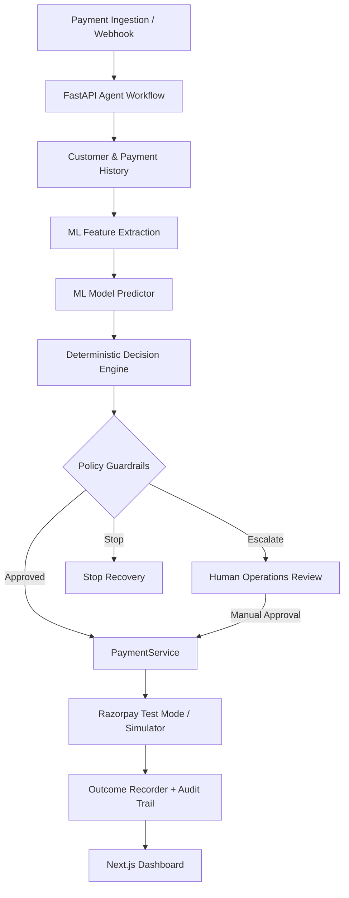

# RevivePay — Autonomous AI Revenue Recovery Platform

**RevivePay** is an autonomous revenue recovery platform built for high-volume merchant operations. It detects failed payments, predicts recovery probability using machine learning, selects the safest intervention, executes approved actions, and maintains a complete audit trail.

> **Zero LLM in Financial Decision Path:** Financial decisions, ML predictions, policy enforcement, and payment execution operate without LLMs.

> **Environment:** Simulation / Razorpay Test Mode. All monetary values are generated dynamically from database records.

---

## Key Features

- **Autonomous Recovery Loop:** Detect → Diagnose → Predict → Decide → Guard → Act → Measure → Audit
- **ML Prediction:** Logistic Regression, Random Forest, and XGBoost for recovery probability.
- **Deterministic Decision Engine:** Selects actions such as Retry, Wait & Retry, Customer Action, Escalate, or Stop.
- **Policy Guardrails:** Retry limits, probability thresholds, high-value escalation, permanent-failure stops, and cooldown rules.
- **PaymentService:** Unified abstraction for Razorpay Test Mode and deterministic simulation.
- **Audit Trail:** Records decisions, actions, reasoning, policy results, and outcomes.
- **Batch Evaluation:** Supports 500-event demo batches with live recovery KPIs.

---

## System Architecture

## Agent Workflow

stateDiagram-v2
    [*] --> Received

    Received --> Context: Payment Failed
    Context --> Analysis: Fetch History
    Analysis --> Prediction: Classify Failure
    Prediction --> Plan: Calculate Recovery Probability
    Plan --> Policy: Select Intervention

    Policy --> Execute: Approved
    Policy --> Escalate: Rule Violated
    Policy --> Stop: Unsafe / Low Probability

    Execute --> Measure: PaymentService
    Measure --> Audit: Record Outcome

    Escalate --> HumanReview: Merchant Review
    HumanReview --> Execute: Approve
    HumanReview --> Stop: Reject

    Audit --> [*]
    Stop --> [*]
